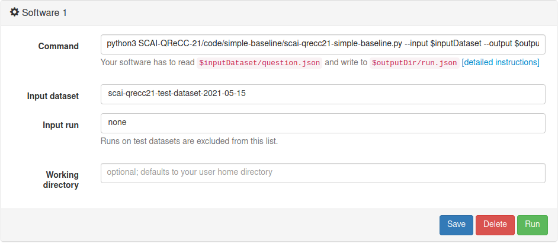
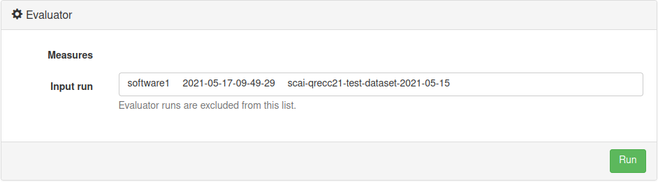

# SCAI-QReCC-21
[[leaderboard](https://www.tira.io/task/scai-qrecc/dataset/scai-qrecc21-test-dataset-2021-05-15)] [[registration](https://docs.google.com/forms/d/e/1FAIpQLSem7NXwDSgv2SLJrXhuHPxGifOOyzqewcu41hTIV3ywqRcr_A/viewform?usp=sf_link)] [[forum](https://www.tira.io/c/scai/)] [[contact](mailto:scai-qrecc@googlegroups.com)] [[SCAI](https://scai.info/)]

Answer a series of contextually-dependent questions like they may occur in natural human-to-human conversations.

- Submission deadline: September 8, 2021
- Results announcement: September 30, 2021
- Workshop presentations: October 8, 2021


## Data
[[dialogues](https://zenodo.org/record/4772532/files/scai-qrecc21-questions.json?download=1)] [[passages](https://zenodo.org/record/4772532/files/passages.zip?download=1)] [[Zenodo](https://doi.org/10.5281/zenodo.4748782)]

The input format for the task (questions) is a JSON file:
```
[
  {
    "Conversation_no": <number>,
    "Turn_no": X,
    "Context": [ "<question1>", "<answer-to-question1>", ... "<questionX-1>", "<answer-to-questionX-1>" ],
    "Question": "<questionX>"
  }, ...
]
```
With `X` being the number of the question in the conversation. Questions with the same `Conversation_no` are from the same conversation.

Upon request, we will provide question files and submission possibilities for systems that address not all three steps.


## Submission
Register for the task using [this form](https://docs.google.com/forms/d/e/1FAIpQLSem7NXwDSgv2SLJrXhuHPxGifOOyzqewcu41hTIV3ywqRcr_A/viewform?usp=sf_link). We will then send you your TIRA login once it is ready.

The challenge is hosted on [TIRA](https://www.tira.io/task/scai-qrecc/dataset/scai-qrecc21-test-dataset-2021-05-15). Participants are encouraged to upload their code and run the evaluation on the VMs provided by the platform to ensure reproducibility of the results. It is also possible to upload the submission as a single JSON file.

The submission format for the task is a JSON file similar to the input (all `Model_xxx`-fields are optional and you can omit them from the submission, e.g. provide only Conversation_no, Turn_no and Model_answer to get the EM and F1 scores for the generated answers):
```
[
  {
    "Conversation_no": <number>,
    "Turn_no": X,
    "Model_rewrite": "<your-rewrite-of-questionX>",
    "Model_passages": { 
      "<ID-of-your-first-retrieved-passage-for-questionX>": <score-for-that-passage>, ...
    },
    "Model_answer": "<your-answer-for-questionX>"
  }, ...
]
```
Example: [QReCC paper (NAACL) baseline](https://zenodo.org/record/4772532/files/scai-qrecc21-naacl-baseline.zip?download=1)

You can use the [code of our simple baseline](https://github.com/scai-conf/SCAI-QReCC-21/tree/main/code/simple-baseline) to get started.

### Software Submission
We recommend participants to upload (through SSH or RDP) their software/system to their dedicated TIRA virtual machine (assigned after registration), so that their runs can be reproduced and so that they can be easily applied to different data (of same format) in the future. The mail send to you after registration gives you the credentials to access the TIRA web interface and your VM. If you cannot connect to your VM, ensure it is powered on in the TIRA web interface.

Your software is expected to accept two arguments:
  - An input directory (named `$inputDataset` in TIRA) that contains the `questions.json` input file and `passages-index-anserini` directory. The latter contains a full [Anserini](https://github.com/castorini/anserini) index of the passage collection. Note that you need to install `openjdk-11-jdk-headless` to use it. We may be able to add more of such indices on request.
  - An output directory (named `$outputDir` in TIRA) into which your software needs to place the submission as `run.json`.

Install your software to your VM. Then go to the TIRA web interface and click "Add software". Specify the command to run your software (see the image for the [simple baseline](https://github.com/scai-conf/SCAI-QReCC-21/tree/main/code/simple-baseline)).

IMPORTANT: To ensure reproducibility, create a "Software" in the TIRA web interface for each parameter setting that you consider a submission to the challenge.

Click on "Run" to execute your software for the selected input dataset. Your VM will not be accessible while your system is running, be detached from the internet (to ensure your software is fully installed in your virtual machine), and afterwards restored to the state before the run. Since the test set is rather large (the simple baseline takes nearly 11 hours to complete), we highly recommend you first test your software on the `scai-qrecc21-toy-dataset-2021-05-15` input dataset. This dataset contains the first conversation (12 turns/questions) only.



Then go to the "Runs" section below and click on the blue (i)-icon of the software run to check the software output. You can also download the run from there.

NOTE: By submitting your software you retain full copyrights. You agree to grant us usage rights for evaluation of the corresponding data generated by your software. We agree not to share your software with a third party or use it for any purpose other than research.

### Run Submission
Coming soon


## Evaluation
[[script](https://github.com/scai-conf/SCAI-QReCC-21/tree/main/code/evaluation-script)]

Once you run your software or uploaded your run, "Run" the evaluator on that run through the TIRA web interface (below the software; works out-of-the-box).



Then go to the "Runs" section below and click on the blue (i)-icon of the evaluator run to see your scores.

### Ground truth
We use the [QReCC paper](https://arxiv.org/abs/2010.04898) annotations in the initial phase, and will update them with alternative answer spans and passages by pooling and crowdsourcing the relevance judgements over the results submitted by the challenge participants (similar to the TREC evaluation setup).

### Metrics
We use the same metrics as the [QReCC paper](https://arxiv.org/abs/2010.04898), but may add more for the final evaluation: ROUGE1-R for question rewriting, Mean Reciprocal Rank (MRR) for passage retrieval, and F1 and Exact Match for question answering.

### Baselines
We provide the following baselines for comparison:
  - **scai-qrecc21-simple-baseline**: BM25 baseline for passage retrieval using original conversational questions without rewriting. We recommend to use [this code](https://github.com/scai-conf/SCAI-QReCC-21/tree/main/code/simple-baseline) as a boilerplate to kickstart your own submission using the VM.
  - **scai-qrecc21-naacl-baseline**: results for the end-to-end approach using supervised question rewriting and QA models reported in the [QReCC paper](https://arxiv.org/abs/2010.04898) (accepted at NAACL'21). This sample run is available [here](https://zenodo.org/record/4772532/files/scai-qrecc21-naacl-baseline.zip?download=1).
  
Note that the baseline results differ from the ones reported in the paper since we made one correction to the evaluation script: we do not evaluate the samples for which the ground truth is missing (i.e., no relevant passages or no answer text or no rewrite provided by the human annotators). We also changed the ROUGE implementation which caused minor differences there.

### Resources
Some useful links to get you started on a new conversational open-domain QA system:

#### Conversational Passage Retrieval (CPR)

  - [Chatty Goose](https://github.com/castorini/chatty-goose)

#### Dense Passage Retrieval (DPR)

  - [Haystack](https://colab.research.google.com/github/deepset-ai/haystack/blob/master/tutorials/Tutorial6_Better_Retrieval_via_DPR.ipynb)
  - [ColBERT](https://github.com/stanford-futuredata/ColBERT)

#### Question Reformulation (QR)

  - [QuReTeC](https://github.com/nickvosk/sigir2020-query-resolution)
  - [BART-FC](https://github.com/aquaktus/CAsT_BART_query_rewriting)


